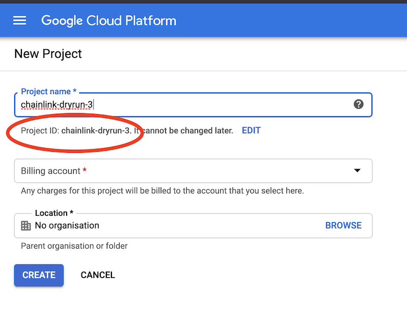

# Hosting a Chainlink node on Google Cloud

## Context
This repository helps you install a high-available pool of chainlink nodes on Google Cloud Platform, running on Kubernetes and Cloud SQL. The setup follows the best practices put forward by the [Chainlink documentation](https://docs.chain.link/docs/best-security-practices).

## Prerequisits
In order to have a smooth installation, it is assumed you have created a project on Google Cloud Platform and have installed and authenticated the [Google Cloud SDK](https://cloud.google.com/sdk/install) on your local machine.

Make sure you can run the following command to validate gcloud is installed correctly and you are authenticated with the correct Google account:
```bash
gcloud auth list
```

You will also need to install [Terraform](https://www.terraform.io/). This setup has been tested with version `0.12`. Run the following to confirm:
```bash
terraform version
```

## Installation
While all steps have been tested on Mac OS X Catalina, they should be portable to any other OS capable of running Terraform and the Google Cloud SDK.

### 1. Getting the code
We'll need the files in this repo, so go ahead and clone it to your local machine. If you're unfamiliar with git, download a ZIP of this repo and extract it.
```bash
git clone https://github.com/Pega88/chainlink-gcp
cd chainlink-gcp
```
### 2. Preparing your environment
Follow [Google's documentation](https://cloud.google.com/resource-manager/docs/creating-managing-projects) and create a new project and __enable billing__ on the project. Remember the project id you chose.




### 3. Running the initialization
Run the `setup.sh` script passing 2 paramters:
* the project id of the project you created (**not** the project name). If you are unsure, you can run
`gcloud projects list` to get the list of your projects ids.
* the email address you wish to use for your Chainlink Node login. A password will be generated and shown as output of the script.

**for example**
```bash
sh setup.sh chainlink-dryrun-3 admin@gmail.com
```
This script will prepare the environment for you with the following steps. Please have 10 minutes patience for it to complete.
#### Steps:
* Create Google Service Account & Generate Key
* Grant Service Account access to create required resources
* Run terraform

The terraform code will:
* Create a Google Kubernetes Engine Cluster on Google Cloud
* Create a `chainlink` namespace
* Deploy a postgres database in the cluster
* Deploy a Chainlink Node in the cluster
* Expose the Node using a HTTP L7 Google Cloud Global Load Balancer

To read more about the advantages of this GCLB, please visit [the docs](https://cloud.google.com/load-balancing/docs/https).

If you are live following the deployment from the Google Cloud Console, be aware it's expected to have pending pods or restart loops, as the chainlink node requires the postgres database to be fully initialized first. Terraform will only return when everything is fully functional, so please be patient.

### 4. Connecting to your Chainlink Node
The output of the script will provide you with an IP address, a chainlink node password (api-credentials) and a wallet password for your ethereum wallet of the node.

Visit the IP address to login using the email address you provided before and the password shown in the output. Please note that it can take **up to 20 minutes** for Google to fully provision the Load Balancer. In the meantime you can get 503 and 404 errors.


### 5. Donations
If you like this project and want to support further development:

`BTC: 36PX1UfcCt3BYiVvvd6vyJM9totHPLqBzo`  
`ETH/LINK: 0x3340F150115C2081C33eee57560E5712a19105dE`
